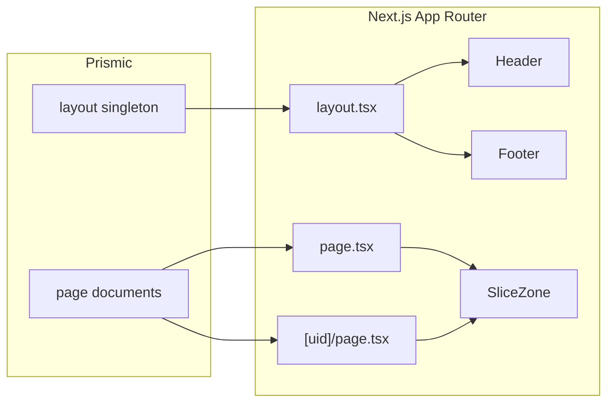

# Prismic website structure (micron-eagle pattern)

This document describes how this repository wires **Next.js**, **Prismic**, and **Slice Machine** so you can reuse the same pattern on other client sites.

## Stack recap

- **Next.js** (App Router) with **TypeScript**
- **Prismic** via `@prismicio/client`, `@prismicio/react`, and `@prismicio/next`
- **Slice Machine** for slice models and the generated slice registry
- **CSS Modules** for component styles

Deployed to Vercel. See also the project root `CLAUDE.md` for commands and day-to-day workflow.

## “Company config” vs this project

Some Bonneval projects store company name, legal text, or env-driven values in a **`company-config.json`** plus `.env.local` (see the company-config Cursor skill). **This repo does not use that pattern.**

Here, **all global, editor-controlled site configuration** lives in Prismic as the **`layout`** singleton (logos, navigation, footer links, contact blocks, social links). Per-page content and SEO live in **`page`** documents.

Choose per project: Prismic-only globals (this pattern), JSON/env helpers, or a hybrid.

## Custom types

### `layout` (singleton)

**Purpose:** One document for sitewide “chrome”: branding, header nav, footer links, and contact/social content that repeats on every page.

**Definition:** [`customtypes/layout/index.json`](../customtypes/layout/index.json)

Field groups:

| Group | Role |
| --- | --- |
| **Site config** | `header_logo`, `footer_logo`, `favicon`; Aberdeen and Houston address/phone/email/hours; optional `phone_menu`, `primary_email`; repeatable `social_links` (platform + URL). |
| **Header & navigation** | Repeatable `nav_links` (label + Prismic link). |
| **Footer** | Repeatable `footer_links` (label + link). |

Editors maintain a single **Layout** document in Prismic; the app fetches it once per request in the root layout (see below).

### `page` (repeatable)

**Purpose:** Each routable page has its own document: main content lives in a **slice zone**; SEO fields drive metadata.

**Definition:** [`customtypes/page/index.json`](../customtypes/page/index.json)

Notable fields:

- **`uid`** — Used in URLs (except the homepage, which uses the reserved UID `home` mapped to `/`).
- **`title`**, optional **`section`**, **`intro`** — Page-level fields (e.g. for listings or nav grouping).
- **`slices`** — Slice Zone; allowed slices are listed as `choices` here. Each choice must match a key in [`src/slices/index.ts`](../src/slices/index.ts).
- **SEO & Metadata** — `meta_title`, `meta_description`, `meta_image` for `generateMetadata` in the App Router.

## Routing

**Client configuration:** [`src/prismicio.ts`](../src/prismicio.ts)

The `routes` array tells Prismic how to resolve document URLs for links and previews:

- `page` with `uid: "home"` → `/`
- Any other `page` → `/:uid`

So the UID is the path segment (e.g. UID `services` → `/services`). The homepage is special-cased so it lives at `/` instead of `/home`.

**Static generation:** [`src/app/[uid]/page.tsx`](../src/app/[uid]/page.tsx) exports `generateStaticParams`, which lists all `page` documents **except** `home`, so Next can pre-render inner pages at build time.

## Data flow



1. **`createClient()`** in [`src/prismicio.ts`](../src/prismicio.ts) configures caching: in production, `force-cache` with a `prismic` tag; in development, `revalidate: 5` seconds for quicker feedback.
2. **Root layout** [`src/app/layout.tsx`](../src/app/layout.tsx) calls `client.getSingle("layout")` and passes `layout.data` (and `nav_links` / `footer_links`) into `<Header>` and `<Footer>`. If the document is missing, `.catch(() => null)` allows the shell to render with empty config.
3. **Home** [`src/app/page.tsx`](../src/app/page.tsx) loads `page` with UID `home` and passes `home.data.slices` to `<SliceZone>`.
4. **Dynamic pages** [`src/app/[uid]/page.tsx`](../src/app/[uid]/page.tsx) load `page` by `params.uid` the same way.
5. **`<SliceZone>`** receives `components` from [`src/slices/index.ts`](../src/slices/index.ts), which maps Prismic slice API IDs to React components (dynamic imports).

## Slices

**Folder layout** (per slice):

```
src/slices/<SliceName>/
  index.tsx       # SliceComponentProps<Content.XxxSlice>
  index.module.css
  model.json      # Slice Machine model
```

Use `slice.primary` for non-repeatable fields and `slice.items` for repeatable groups. Prefer `PrismicRichText`, `PrismicNextImage`, and `PrismicNextLink` from `@prismicio/react` / `@prismicio/next`.

**Registry:** `src/slices/index.ts` is **generated by Slice Machine** — do not hand-edit except when resolving merge conflicts; after model changes, run Slice Machine so the map stays aligned with `customtypes/page` slice choices.

**Adding a slice (high level):**

1. Create the slice in Slice Machine (`npm run slicemachine`) and push/sync models.
2. Add the slice to the **page** custom type’s slice zone `choices` if it should appear on pages.
3. Regenerate types (`prismicio-types.d.ts`) via Slice Machine.
4. Verify the new API ID appears in `src/slices/index.ts`.
5. Test in the Slice Simulator: [`src/app/slice-simulator/page.tsx`](../src/app/slice-simulator/page.tsx) — local URL `/slice-simulator`.

For detailed slice authoring, use the **slice-builder** Cursor skill and Prismic’s Slice Machine docs.

## Header and footer

**Integration:** [`src/app/layout.tsx`](../src/app/layout.tsx) fetches layout once; [`src/components/Header.tsx`](../src/components/Header.tsx) and [`src/components/Footer.tsx`](../src/components/Footer.tsx) receive:

- **`config`** — `Content.LayoutDocument["data"] | null` (full layout field object).
- **`navLinks` / `footerLinks`** — The `nav_links` and `footer_links` groups (passed explicitly for clarity; they are part of the same document).

The header uses `header_logo` and maps `nav_links` with `PrismicNextLink`. The footer picks `footer_logo`, falling back to `header_logo`; it renders `footer_links` and the contact/social blocks from `config`.

**CMS vs code:** Office headings in the footer (**“Aberdeen (HQ)”** and **“Houston”**) are **hardcoded in React** in this project—only addresses, phones, emails, and hours come from Prismic. If a future site needs fully CMS-driven region names, extend the `layout` model and render those fields instead of static strings.

## Quick reference table

| Concern | Location |
| --- | --- |
| Global site config | Prismic `layout` singleton — [`customtypes/layout/index.json`](../customtypes/layout/index.json) |
| Pages + SEO + slices | Prismic `page` — [`customtypes/page/index.json`](../customtypes/page/index.json) |
| URL rules | [`src/prismicio.ts`](../src/prismicio.ts) |
| Layout fetch + chrome | [`src/app/layout.tsx`](../src/app/layout.tsx), [`Header.tsx`](../src/components/Header.tsx), [`Footer.tsx`](../src/components/Footer.tsx) |
| Home route | [`src/app/page.tsx`](../src/app/page.tsx) |
| Other routes | [`src/app/[uid]/page.tsx`](../src/app/[uid]/page.tsx) |
| Slice components map | [`src/slices/index.ts`](../src/slices/index.ts) |

## Checklist: new Prismic site using this pattern

1. **Content model** — Create (or duplicate) `layout` and `page` custom types; adjust `layout` field groups for the client’s real offices/links; keep `page` slice `choices` in sync with slices you build.
2. **Routes** — Set `routes` in `src/prismicio.ts` (homepage UID + `/:uid` pattern).
3. **App Router** — Root layout: `getSingle("layout")` → Header/Footer. Add `page.tsx` for home UID and `[uid]/page.tsx` with `SliceZone` + `generateMetadata` + `generateStaticParams` as needed.
4. **Slices** — Implement under `src/slices/`, register via Slice Machine, test at `/slice-simulator`.
5. **Previews** — Configure `/api/preview` and `/api/exit-preview` (already present in this template) for draft content.

---

*This guide is specific to the micron-eagle codebase; adapt naming and fields when cloning the pattern for another client.*
