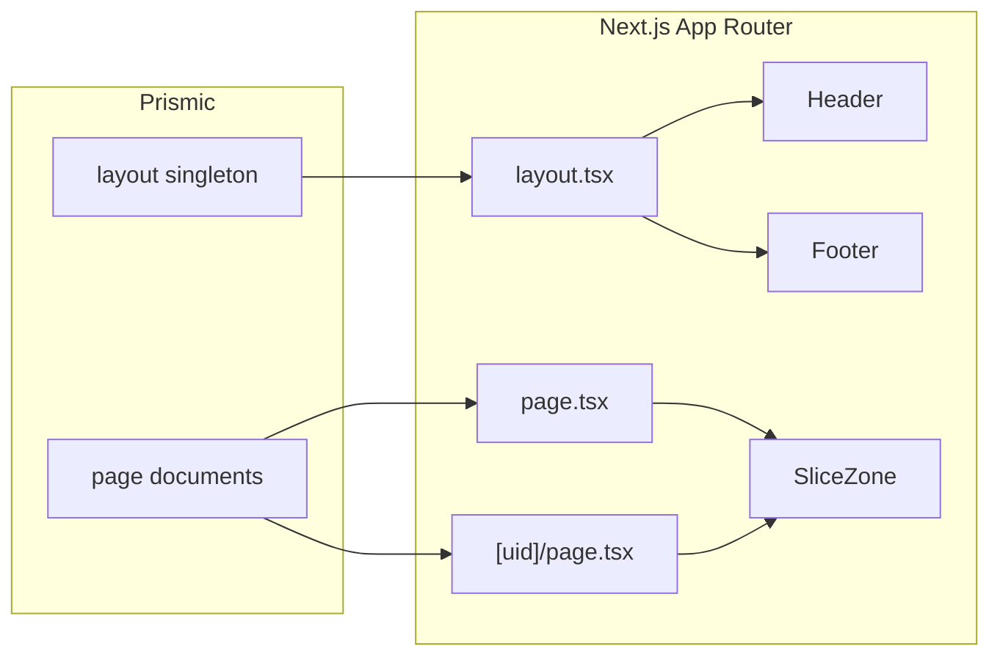

# Prismic + Next.js site structure (template pattern)

This document describes a **reusable architecture**: **Next.js (App Router)**, a Prismic **`layout`** singleton for global config, **`page`** documents for routable content, and **slices** for page sections. **Content, branding, and field names change per website; the wiring stays the same.**

This repository is one implementation of that pattern—you can copy the approach and swap models, slices, and components for another client without changing the overall flow.

## Stack recap

- **Next.js** (App Router) with **TypeScript**
- **Prismic** via `@prismicio/client`, `@prismicio/react`, and `@prismicio/next`
- **Slice Machine** for slice models and the generated slice registry
- **CSS Modules** for component styles (or your preferred styling approach)

See the project root `CLAUDE.md` for commands and local workflow.

## Global config: where it lives

**Pattern:** Keep **editor-controlled global settings** (logos, navigation, footer links, contact info, social links, legal snippets, etc.) in a **single Prismic document** fetched in the root layout, not duplicated on every page.

Some teams also use a **`company-config.json`** plus `.env.local` for build-time or non-CMS values. That is optional and separate from Prismic. **This template stores globals in Prismic** via the **`layout`** custom type. You can combine approaches per project if needed.

## Custom types

### `layout` (singleton)

**Purpose:** One document for sitewide “chrome”: anything that should stay consistent across routes—branding, header nav, footer links, and repeated contact or utility content.

**Pattern:** Group fields in Slice Machine tabs (e.g. site-wide assets, header, footer) so editors have a clear place to maintain globals.

**In this repo:** [`customtypes/layout/index.json`](../customtypes/layout/index.json)

Typical field *categories* (rename and extend per site):

| Category | Examples (adjust per client) |
| --- | --- |
| **Brand / assets** | Header logo, optional footer logo, favicon |
| **Navigation** | Repeatable nav items (label + link) |
| **Footer** | Repeatable footer links (label + link) |
| **Contact & social** | Addresses, phones, emails, hours; optional repeatable social links; any extra blocks your footer design needs |

The app calls `getSingle("layout")` once in the root layout and passes the result into header and footer components. Field **API IDs** (`nav_links`, `footer_links`, etc.) must match what your React components read—when you rename or add fields, update the custom type and the components together.

### `page` (repeatable)

**Purpose:** Each public URL is backed by a **`page`** document: structured content in a **slice zone**, plus SEO.

**Pattern:**

- **`uid`** — Becomes the URL path segment, except the homepage UID you map to `/` in `prismicio.ts` (commonly `home`).
- **Page-level fields** — Optional extras such as title, section tag, intro—only what you need for listings, SEO, or layout.
- **`slices`** — Allowed slice types are listed as `choices` in the custom type; each must match a key in the generated [`src/slices/index.ts`](../src/slices/index.ts).
- **SEO** — e.g. `meta_title`, `meta_description`, `meta_image` for `generateMetadata`.

**In this repo:** [`customtypes/page/index.json`](../customtypes/page/index.json)

## Routing

**Client configuration:** [`src/prismicio.ts`](../src/prismicio.ts)

The `routes` array tells Prismic how to resolve document URLs (links, previews):

- One **`page`** document with a **reserved homepage UID** (e.g. `home`) → `/`
- All other **`page`** documents → `/:uid`

So `services` → `/services`. The homepage is special-cased so it is not served at `/home`.

**Static generation:** [`src/app/[uid]/page.tsx`](../src/app/[uid]/page.tsx) can export `generateStaticParams` to list every `page` except the homepage UID, so inner routes pre-render at build time.

## Data flow



1. **`createClient()`** — Configure caching (e.g. `force-cache` + tags in production, short `revalidate` in development) in [`src/prismicio.ts`](../src/prismicio.ts).
2. **Root layout** [`src/app/layout.tsx`](../src/app/layout.tsx) — `getSingle("layout")`, pass data to `<Header>` and `<Footer>`. Graceful `null` if the document is missing.
3. **Home** [`src/app/page.tsx`](../src/app/page.tsx) — Load the homepage `page` by UID, pass `data.slices` to `<SliceZone>`.
4. **Dynamic routes** [`src/app/[uid]/page.tsx`](../src/app/[uid]/page.tsx) — Load `page` by `params.uid` the same way.
5. **`<SliceZone>`** — Maps slice API IDs to React components via [`src/slices/index.ts`](../src/slices/index.ts) (dynamic imports).

## Slices

**Folder layout** (per slice):

```
src/slices/<SliceName>/
  index.tsx       # SliceComponentProps<Content.XxxSlice>
  index.module.css
  model.json      # Slice Machine model
```

Use `slice.primary` and `slice.items` as defined in the model. Prefer Prismic’s React helpers for rich text, images, and links.

**Registry:** `src/slices/index.ts` is **generated by Slice Machine**—keep it in sync with the **page** slice zone; resolve merge conflicts carefully.

**Adding a slice (high level):**

1. Define the slice in Slice Machine (`npm run slicemachine`) and sync models.
2. Add it to the **`page`** slice zone `choices` if it should appear on pages.
3. Regenerate types (`prismicio-types.d.ts`).
4. Confirm the API ID appears in `src/slices/index.ts`.
5. Test via the Slice Simulator ([`src/app/slice-simulator/page.tsx`](../src/app/slice-simulator/page.tsx)) at `/slice-simulator`.

For deeper slice work, use the **slice-builder** Cursor skill and Prismic’s Slice Machine documentation.

## Header and footer

**Pattern:** Global chrome reads from the **`layout`** document only; it does not live in the page slice zone.

**In this repo:** [`src/app/layout.tsx`](../src/app/layout.tsx) fetches once; [`src/components/Header.tsx`](../src/components/Header.tsx) and [`src/components/Footer.tsx`](../src/components/Footer.tsx) receive:

- **`config`** — `Content.LayoutDocument["data"] | null` (or your generated type for the layout document).
- **Link groups** — Often passed explicitly (e.g. `nav_links`, `footer_links`) for clarity; they still come from the same document.

Components map **field API IDs** to UI (logos, links, contact blocks). When you add a new global field, extend the custom type and wire it in these components.

**CMS vs code:** Any **labels** hardcoded in JSX (e.g. region titles, column headings) stay fixed until you change code. **Values** (addresses, numbers, links) should come from Prismic when editors need control. If labels must be editable, add structured fields or a repeatable group and render them from the model instead of string literals.

## Quick reference

| Concern | Location |
| --- | --- |
| Global site config | Prismic `layout` singleton — [`customtypes/layout/index.json`](../customtypes/layout/index.json) |
| Pages + SEO + slices | Prismic `page` — [`customtypes/page/index.json`](../customtypes/page/index.json) |
| URL rules | [`src/prismicio.ts`](../src/prismicio.ts) |
| Layout fetch + chrome | [`src/app/layout.tsx`](../src/app/layout.tsx), [`Header.tsx`](../src/components/Header.tsx), [`Footer.tsx`](../src/components/Footer.tsx) |
| Home route | [`src/app/page.tsx`](../src/app/page.tsx) |
| Other routes | [`src/app/[uid]/page.tsx`](../src/app/[uid]/page.tsx) |
| Slice components map | [`src/slices/index.ts`](../src/slices/index.ts) |

## Checklist: new site, same pattern

1. **Model** — Define `layout` and `page` (or copy and rename). Tailor `layout` groups to the client’s real content; keep `page` slice `choices` aligned with slices you build.
2. **Routes** — Set `routes` in `src/prismicio.ts` (homepage UID + `/:uid`).
3. **App Router** — Root layout: `getSingle("layout")` → Header/Footer. `page.tsx` for home; `[uid]/page.tsx` with `SliceZone`, `generateMetadata`, and optional `generateStaticParams`.
4. **Slices** — Build under `src/slices/`, register via Slice Machine, verify at `/slice-simulator`.
5. **Previews** — Wire draft preview routes if the template includes them (`/api/preview`, `/api/exit-preview`).

---

**Summary:** Swap **content models, slices, and branding** per project; keep **singleton layout + repeatable pages + route resolvers + SliceZone** as the stable skeleton.
